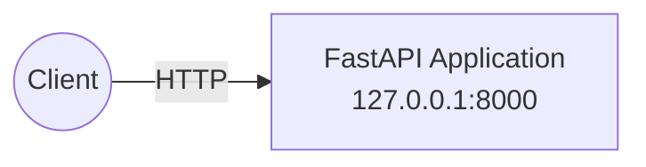
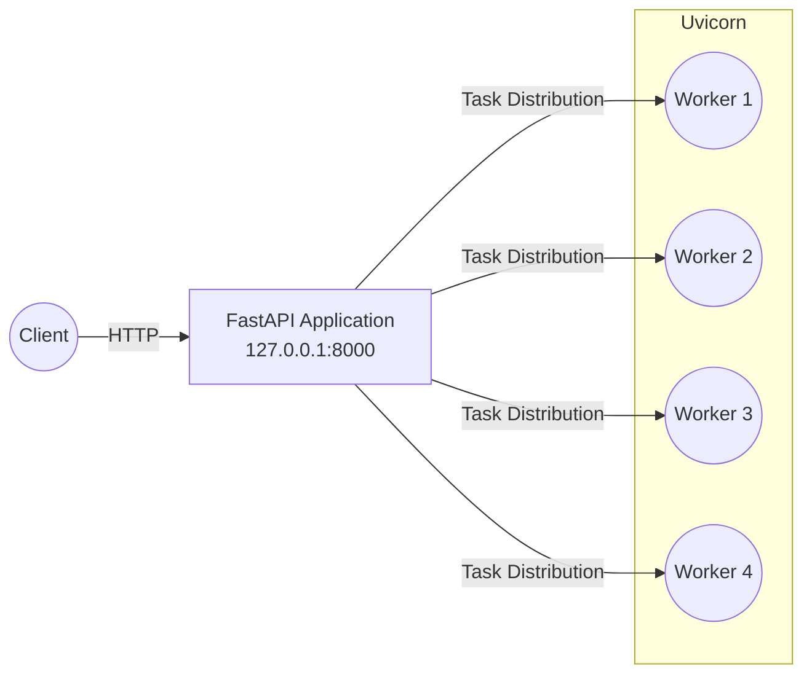
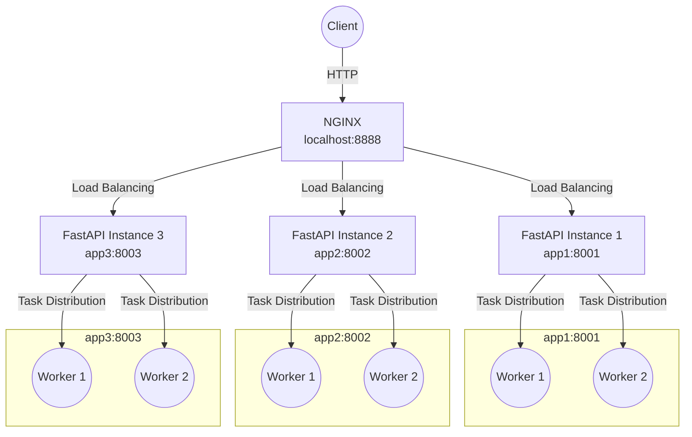

### Scenario 1: Single Instance (Direct Access)

* Start the application:
  
	```bash
	python.exe -m uvicorn app:app --host 127.0.0.1 --port 8000
	```

* Send a test request:
  
	```bash
	curl http://127.0.0.1:8000/process
	```

* Load test:
  
	```bash
	docker run --rm ab-tester -n 250 -c 50 http://host.docker.internal:8000/process
	```

#### Mermaid Diagram of the Architecture




### Scenario 2: Single Instance, Multiple Workers

* Start the application with multiple workers:
  
	```bash
	python.exe -m uvicorn app:app --host 127.0.0.1 --port 8000 --workers 4
	```

* Load test:
  
	```bash
	docker run --rm ab-tester -n 100 -c 50 http://host.docker.internal:8000/process
	```

#### Mermaid Diagram of the Architecture




### Scenario 3: NGINX + Multiple FastAPI Instances (Each with 2 Workers)

In this scenario, multiple FastAPI instances (app1, app2, app3) and NGINX are started together using Docker Compose. Each FastAPI instance is started with 2 workers. NGINX load balances incoming requests across the backend application containers.

#### 1. Required Files

- `Dockerfile` (for the application)
- `docker-compose.yml`
- `nginx/default.conf` (NGINX configuration)
- `start.sh` (Uvicorn starter)
- `requirements.txt`

#### 2. Start with Docker Compose

Run the following command in the project folder:

```bash
docker compose up --build
```

* Load test:

```bash
docker run --rm ab-tester -n 300 -c 50 http://host.docker.internal:8888/process
```

#### Mermaid Diagram of the Architecture


